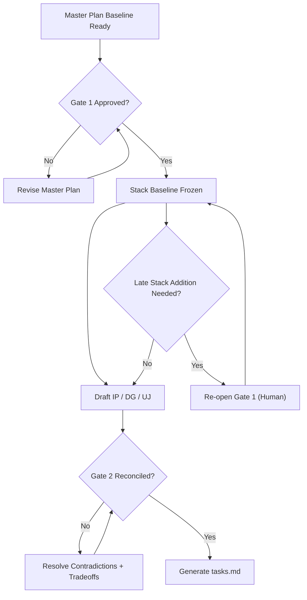

# PRD Rules (Design-First v5)

## A. Purpose and PRD File Set
This rulebook defines how PRD files are written, reviewed, and linked through a design-first workflow.

PRD files:
- Core files:
  - `master-plan.md`
  - `implementation-plan.md`
  - `design-guideline.md`
  - `user-journey.md`
  - `tasks.md`


Lifecycle summary: write master plan first, freeze baseline at Gate 1, draft downstream docs, reconcile at Gate 2, then generate tasks.

## B. Sequence Reference (Text Fallback)
Use this fallback sequence when a textual checklist is preferred:
1. Master plan baseline.
2. Gate 1 human approval and stack freeze.
3. Downstream drafting (`implementation-plan.md`, `design-guideline.md`, `user-journey.md`).
4. Gate 2 reconciliation.
5. `tasks.md` generation.

## C. Master Plan Baseline
`master-plan.md` must be complete before Gate 1. It acts as the catalog baseline for scope, stacks, page model, and high-level design intent.

Recommended section titles for `master-plan.md`:
1. Purpose and Users
2. Scope and Non-goals
3. Applicable Stacks Baseline
4. UI Components and Design Patterns
5. Page Inventory and Relationships
6. High-level Design Intent
7. Risks, Decisions, and Stack Additions
   - Each stack addition item should include:
     - design driver
     - proposed stack addition
     - alternatives considered
     - expected impact (`performance`, `security`, `operations`, `maintenance`)
     - decision status (`approved`, `deferred`, `rejected`)
     - rationale

## D. Gate Logic Diagram

Gate summary: after Gate 1, stack changes are frozen by default; late stack additions require explicit Gate 1 re-open.

## E. Downstream Document Contracts
Use clear section titles in downstream docs so authors and reviewers can scan quickly.

| File | Suggested Section Titles | Focus |
|---|---|---|
| `implementation-plan.md` | Architecture Boundaries; API and Schema Direction; Integration and Verification | Technical execution within frozen stacks |
| `design-guideline.md` | UI by Page Group; Component Purpose Map; Wireframe Layout Sketches; State Handling | Page-level UI behavior and structure |
| `user-journey.md` | Cross-page Flows; Role Handoffs; Failure and Recovery Paths | User movement and system response across pages |

## F. Reconciliation (Gate 2)
Gate 2 validates that implementation, design, and journey docs are consistent before task generation.

Reconciliation checks:
1. No scope contradictions against the master plan baseline.
2. No stack drift beyond Gate 1 approvals.
3. No page-model mismatch across implementation, design, and journey docs.
4. Any unresolved tradeoff is escalated to a human decision and documented.

## G. Task Rules
`tasks.md` is produced only after Gate 2 and should remain traceable to upstream PRD decisions.

| Field | What It Captures | Notes |
|---|---|---|
| `task_ref` | Task reference id | Use Section H format |
| `source_refs` | Upstream references | Should include relevant MP/IP/DG/UJ refs |
| `problem` | Why this task exists | Keep concise and concrete |
| `goal` | Expected outcome | Actionable target |
| `stacks_used` | Stacks this task uses | Must align with Gate 1 baseline or Gate 1 re-open decision |
| `test_plan` | How to validate | Static/e2e/integration as applicable |
| `smoke_example` | Fast scenario check | Given/When/Then or command+expected |
| `acceptance_criteria` | Done conditions | Measurable and testable |
| `evidence` | Completion proof | Required when status is done |

Tasks should not introduce unapproved scope or unapproved stack changes. If a task requires a new stack, it must reference a Gate 1 re-open decision.

## H. Reference Format
References use `Doc+Section+Number` so reviewers can jump directly to a sectioned requirement statement. The format is `<DOC>-<SectionLetter><ListNumber>`, for example `MP-B3` means `master-plan.md`, section `B`, list item `3`.

```md
MP-B3
IP-E2
DG-E1
UJ-F4
TS-G5
```

## I. Sub-Agent Operating Model [Optional]
1. Architect lane drafts constraints and stack implications.
2. Design lane drafts page-level UI behavior and layouts.
3. Journey lane drafts transitions, failures, and recovery flow.
4. Reconciliation lane checks cross-doc consistency before tasks.
5. One author can perform all lanes if output quality is equivalent.

## J. Authoring Style
Use short paragraphs for context and intent, then use lists or tables for requirements and contracts. Keep statements concrete and scannable. Avoid overusing numbered lists where a short paragraph or table communicates better.

Style notes:
1. Use numbered lists for stable reference points.
2. Use tables for field contracts and document mapping.
3. Use diagrams for lifecycle and gate logic.
4. Keep one requirement per line item where possible.

## K. Quality Checklist
1. Sequence followed (`master-plan` -> Gate 1 -> downstream docs -> Gate 2 -> `tasks.md`).
2. Gate 1 status and stack freeze state are explicit.
3. Any late stack addition has Gate 1 re-open evidence.
4. Downstream docs align with master-plan baseline.
5. Every task includes `stacks_used`.
6. Acceptance criteria are measurable.
7. No unresolved contradictions remain.
8. References follow `Doc+Section+Number`.

## L. Minimal Templates [Optional]
Gate markers:

```md
gate_1_status: pending | approved | reopened
gate_1_approver: <name/role>
gate_1_date: <YYYY-MM-DD>
gate_2_status: pending | approved
gate_2_approver: <name/role>
gate_2_date: <YYYY-MM-DD>
```

Task snippet:

```md
task_ref: TS-G3
source_refs: MP-C5, IP-E1, DG-E2, UJ-E3
problem: ...
goal: ...
stacks_used: Next.js App Router, Drizzle ORM, Clerk
acceptance_criteria: ...
```

## M. Transition Policy
This policy applies to new PRD cycles and major rewrites. Existing PRDs can migrate incrementally. During migration, declare current section mapping and gate status before continuing work.
