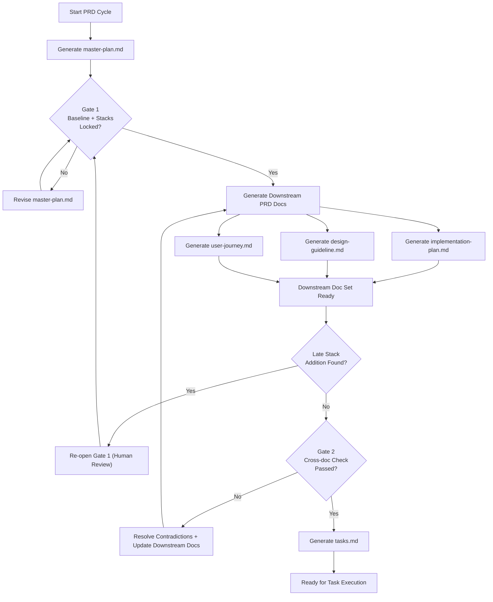

# PRD Rules (Design-First v5)

## A. Purpose and PRD File Set
This rulebook defines how PRD files are written, reviewed, and linked through a design-first workflow.

PRD files:
- `master-plan.md`: catalog baseline for scope, stacks, page model, and high-level design intent
- `implementation-plan.md`: technical execution within frozen stacks
- `design-guideline.md`: page-level UI behavior and structure
- `user-journey.md`: user movement and system response across pages
- `tasks.md`: execution-ready tasks with traceability to upstream PRD decisions

## B. Workflow and Structure Views
This section gives one integrated process map.


The workflow starts by generating `master-plan.md`, then runs Gate 1 to approve baseline scope and freeze stacks. After Gate 1 approval, the three downstream PRD files are generated in parallel and reconciled at Gate 2. `tasks.md` is generated only after Gate 2 passes, while late stack additions force a Gate 1 reopen before reconciliation can continue.

## C. Master Plan Baseline
`master-plan.md` must be complete before Gate 1. It acts as the catalog baseline for scope, stacks, page model, and high-level design intent.

Recommended section titles for `master-plan.md`:
1. Purpose and Users
2. Scope and Non-goals
3. Applicable Stacks Baseline
4. UI Components and Design Patterns
5. Page Inventory and Relationships
6. High-level Design Intent
7. Risks, Decisions, and Stack Additions
   Each stack addition item should include:

   | Field | Description |
   |---|---|
   | `design driver` | Reason the stack addition is being considered |
   | `proposed stack addition` | Specific tool, service, or framework being added |
   | `alternatives considered` | Reasonable alternatives reviewed before the proposal |
   | `expected impact` | Expected effect on `performance`, `security`, `operations`, or `maintenance` |
   | `decision status` | One of `approved`, `deferred`, or `rejected` |
   | `rationale` | Explanation for the decision and expected tradeoff |

## D. Downstream Document Contracts
Use clear section titles in downstream docs so authors and reviewers can scan quickly.

### `implementation-plan.md`
- Architecture Boundaries
- API and Schema Direction
- Integration and Verification

### `design-guideline.md`
- UI by Page Group
- Component Purpose Map
- Wireframe Layout Sketches
- State Handling

### `user-journey.md`
- Cross-page Flows
- Role Handoffs
- Failure and Recovery Paths

## E. Reconciliation (Gate 2)
Gate 2 validates that implementation, design, and journey docs are consistent before task generation.

Reconciliation checks:
1. No scope contradictions against the master plan baseline.
2. No stack drift beyond Gate 1 approvals.
3. No page-model mismatch across implementation, design, and journey docs.
4. Any unresolved tradeoff is escalated to a human decision and documented.

## F. Task Rules
`tasks.md` is produced only after Gate 2 and should remain traceable to upstream PRD decisions.

| Field | What It Captures | Notes |
|---|---|---|
| `task_ref` | Task reference id | Use Section G format |
| `source_refs` | Upstream references | Should include relevant MP/IP/DG/UJ refs |
| `problem` | Why this task exists | Keep concise and concrete |
| `goal` | Expected outcome | Actionable target |
| `stacks_used` | Stacks this task uses | Must align with Gate 1 baseline or Gate 1 re-open decision |
| `test_plan` | How to validate | Static/e2e/integration as applicable |
| `smoke_example` | Fast scenario check | Given/When/Then or command+expected |
| `acceptance_criteria` | Done conditions | Measurable and testable |
| `evidence` | Completion proof | Required when status is done |

Tasks should not introduce unapproved scope or unapproved stack changes. If a task requires a new stack, it must reference a Gate 1 re-open decision.

## G. Reference Format
References use `Doc+Section+Number` so reviewers can jump directly to a sectioned requirement statement. The format is `<DOC>-<SectionLetter><ListNumber>`, for example `MP-B3` means `master-plan.md`, section `B`, list item `3`.

```md
MP-B3
IP-D2
DG-D1
UJ-E4
TS-F5
```

## I. Authoring Style
Document structure:
- Start with a short paragraph that states what the document is and what it is for.
- Add a graph or diagram that shows the overall relation and flow.
- Surround each graph with transition paragraphs: add a short lead-in sentence above it unless the section title already introduces it, then add follow-up text below it for deeper explanation.
- Core sections should follow the same order as the graph, covering each main node section by section.
- Put additional information such as appendices, reference snippets, checklists, templates, or supporting notes in the last several sections of the document.

Preferred formats:
- Use short paragraphs for context and intent.
- Use lists for concise requirements and use tables for field contracts and document mapping.
- Use Mermaid diagrams for workflow, system structure, or data logic when a diagram would improve clarity.
- Use anatomy when the purpose is to illustrate file structure. For a simple file list, a short paragraph, list, or table is acceptable.

Mermaid:
- Prefer vertical flow (`flowchart TB`) for long or dense labels.
- Use compact gate labels for readability. When breaking a gate label across lines, aim for a diamond shape such as `1:2`, `2:1`, or `1:3:1` (short/long or short/medium/short) instead of one long flat line.

Style requirements:
- Use numbered lists for stable reference points that are intended to be cited or referenced later.
- Keep statements concrete and scannable.
- Avoid overusing numbered lists where a short paragraph or table communicates better.
- Avoid content or topic redundancy.
- Keep one requirement per line where possible. Merge only when the requirements are materially the same, partly redundant, or one instruction clearly applies to multiple named conditions.

## J. Quality Checklist

- [ ] Core files are defined and each file purpose is explicit.
- [ ] The workflow diagram reflects PRD generation order, gate timing, and rework paths.
- [ ] Gate 1 status and stack freeze state are explicit.
- [ ] Any late stack addition has Gate 1 re-open evidence.
- [ ] `master-plan.md` follows the baseline structure and each stack addition uses the required fields.
- [ ] Downstream documents use clear section titles that follow their contracts and align with the master-plan baseline.
- [ ] Gate 2 reconciliation checks are satisfied before `tasks.md` is generated.
- [ ] No unresolved contradictions or undocumented tradeoffs remain.
- [ ] Each task includes required traceability and validation fields, including `source_refs`, `stacks_used`, `test_plan`, `smoke_example`, `acceptance_criteria`, and `evidence` when done.
- [ ] Smoke tests are defined where applicable and align with task behavior and acceptance criteria.
- [ ] References follow `Doc+Section+Number`.
- [ ] Authoring style follows Section I.
- [ ] Transition policy or current section mapping and gate status are declared during PRD migration.

## L. Transition Policy
This policy applies to new PRD cycles and major rewrites. Existing PRDs can migrate incrementally. During migration, declare current section mapping and gate status before continuing work.

## H. Sub-Agent Operating Model [Optional]
1. Architect lane drafts constraints and stack implications.
2. Design lane drafts page-level UI behavior and layouts.
3. Journey lane drafts transitions, failures, and recovery flow.
4. Reconciliation lane checks cross-doc consistency before tasks.
5. One author can perform all lanes if output quality is equivalent.

## K. Minimal Templates [Optional]
Gate markers:

```md
gate_1_status: pending | approved | reopened
gate_1_approver: <name/role>
gate_1_date: <YYYY-MM-DD>
gate_2_status: pending | approved
gate_2_approver: <name/role>
gate_2_date: <YYYY-MM-DD>
```

Task snippet:

```md
task_ref: TS-F3
source_refs: MP-C5, IP-D1, DG-D2, UJ-E3
problem: ...
goal: ...
stacks_used: Next.js App Router, Drizzle ORM, Clerk
acceptance_criteria: ...
```
