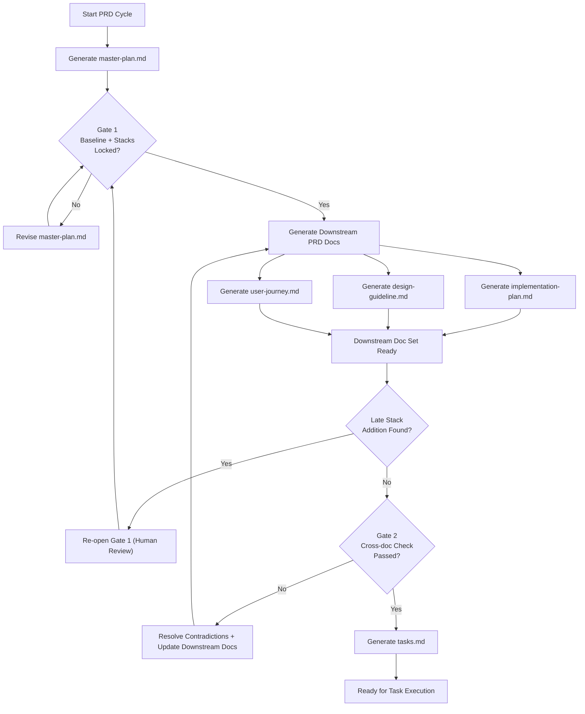

# PRD Rules (Design-First v5)

## A. Purpose and PRD File Set
This rulebook defines how PRD files are written, reviewed, and linked through a design-first workflow.

PRD files:
- `master-plan.md`: catalog baseline for scope, stacks, page model, and high-level design intent
- `implementation-plan.md`: technical execution within frozen stacks
- `design-guideline.md`: page-level UI behavior and structure
- `user-journey.md`: user movement and system response across pages
- `tasks.md`: execution-ready tasks with traceability to upstream PRD decisions

## B. Workflow and Structure Views
This section gives one integrated process map.

**PRD workflow overview**[^PR-B1]


The workflow starts by generating `master-plan.md`, then runs Gate 1 to approve baseline scope and freeze stacks. After Gate 1 approval, the three downstream PRD files are generated in parallel and reconciled at Gate 2. `tasks.md` is generated only after Gate 2 passes, while late stack additions force a Gate 1 reopen before reconciliation can continue.

## C. Master Plan Baseline
`master-plan.md` must be complete before Gate 1. It acts as the catalog baseline for scope, stacks, page model, and high-level design intent.

### Required Core Sections for `master-plan.md`
These sections define the minimum Gate 1 baseline and must appear in `master-plan.md`.

1. Purpose and Users
2. Scope and Non-goals
3. Applicable Stacks Baseline
4. UI Components and Design Patterns
5. Page Inventory and Relationships
6. High-level Design Intent
7. Risks, Decisions, and Stack Additions

### Stack Addition Record Fields
Use this field contract for each stack addition item recorded in the `Risks, Decisions, and Stack Additions` section.

**Stack addition record fields**[^PR-C8]

| Field | Description |
|---|---|
| `design driver` | Reason the stack addition is being considered |
| `proposed stack addition` | Specific tool, service, or framework being added |
| `alternatives considered` | Reasonable alternatives reviewed before the proposal |
| `expected impact` | Expected effect on `performance`, `security`, `operations`, or `maintenance` |
| `decision status` | One of `approved`, `deferred`, or `rejected` |
| `rationale` | Explanation for the decision and expected tradeoff |

## D. Gate 1 Freeze and Approval
Gate 1 happens after `master-plan.md` is complete and before downstream docs are generated. It freezes baseline scope and stack decisions for the current PRD cycle.

Gate 1 checks:
1. `master-plan.md` is complete and follows the Section C baseline.
2. In-scope stacks are explicit and each proposed stack addition has a recorded decision status.
3. Scope, page model, and high-level design intent are stable enough to author downstream docs.
4. Gate 1 status, approver, and date are recorded before downstream generation continues.

If a new stack is introduced later, reopen Gate 1 before downstream reconciliation or task generation continues.

## E. Downstream Document Contracts
Use clear section titles in downstream docs so authors and reviewers can scan quickly.

### `implementation-plan.md`
- Architecture Boundaries
- API and Schema Direction
- Integration and Verification

### `design-guideline.md`
- UI by Page Group
- Component Purpose Map
- Wireframe Layout Sketches
- State Handling

### `user-journey.md`
- Cross-page Flows
- Role Handoffs
- Failure and Recovery Paths

## F. Reconciliation (Gate 2)
Gate 2 validates that implementation, design, and journey docs are consistent before task generation.

Reconciliation checks:
1. No scope contradictions against the master plan baseline.
2. No stack drift beyond Gate 1 approvals.
3. No page-model mismatch across implementation, design, and journey docs.
4. Any unresolved tradeoff is escalated to a human decision and documented.

## G. Task Rules
`tasks.md` is produced only after Gate 2 and should remain traceable to upstream PRD decisions.

**Task field contract**[^PR-G1]

| Field | What It Captures | Notes |
|---|---|---|
| `task_ref` | Task reference id | Use Section I format |
| `source_refs` | Upstream references | Should include relevant MP/IP/DG/UJ refs |
| `problem` | Why this task exists | Keep concise and concrete |
| `goal` | Expected outcome | Actionable target |
| `stacks_used` | Stacks this task uses | Must align with Gate 1 baseline or Gate 1 re-open decision |
| `test_plan` | How to validate | Static/e2e/integration as applicable |
| `smoke_example` | Fast scenario check | Given/When/Then or command+expected |
| `acceptance_criteria` | Done conditions | Measurable and testable |
| `evidence` | Completion proof | Required when status is done |

Tasks should not introduce unapproved scope or unapproved stack changes. If a task requires a new stack, it must reference a Gate 1 re-open decision.

## H. Authoring Style
Document structure:
1. Start with a short paragraph that states what the document is and what it is for.
2. Add a graph or diagram that shows the overall relation and flow.
3. Add a short lead-in sentence above each graph unless the section title already introduces it.
4. Add follow-up text below each graph for deeper explanation.
5. Core sections should usually follow the same order as the graph, covering each main node section by section.
6. Put additional information such as appendices, reference snippets, checklists, templates, or supporting notes in the last several sections of the document.
7. Normative reference rules may appear after the main workflow is fully described, but before supporting materials such as appendices, checklists, templates, or notes.

Preferred formats:
1. Use short paragraphs for context and intent.
2. Use lists for concise requirements and use tables for field contracts and document mapping.
3. Use Mermaid diagrams for workflow, system structure, or data logic when a diagram would improve clarity.
4. Use anatomy when the purpose is to illustrate file structure.
5. For a simple file list, a short paragraph, list, or table is acceptable.

Mermaid:
1. Prefer vertical flow (`flowchart TB`) for long or dense labels.
2. Keep gate labels compact and balanced across lines.

Style requirements:
1. Use numbered lists by default for stable reference points that are intended to be cited or referenced later.
2. Keep statements concrete and scannable.
3. Avoid overusing numbered lists where a short paragraph or table communicates better.
4. Avoid content or topic redundancy.
5. Keep one requirement per line by default.
6. Grouped prose is allowed only when the bundled items are materially the same or enforced, reviewed, or verified together under one instruction or one check.

> [!NOTE]
> These authoring style rules govern the five PRD files listed in Section A.
> When `PRD-rules.md` is edited, review it against these style rules as a self-check, allowing only the minimal meta-spec exceptions needed to explain the reference model itself.

## I. Reference Format
References are required only for statements that are intended to be cited across PRD files.

Reference format:
1. Use `<DOC>-<SectionLetter><Number>` for each reference id, for example `MP-B3`.
2. Numbered list items and titled non-list items share one numbering sequence within the same section.
3. Assign reference ids in reading order within the section so each reference target is unique.
4. Use a title-attached GitHub footnote for titled non-list items and cite the footnote content directly.
5. A whole table uses the table title footnote id, for example `MP-C3`.
6. A table cell may use its own footnote id when that specific cell needs to be referenced directly.

Example title footnote pattern:

```md
**Workflow overview**[^MP-B4]
```

Example titled table footnote pattern:

```md
**Stack addition record fields**[^MP-C3]

| Field | Description |
|---|---|
| `decision status` | One of `approved`, `deferred`, or `rejected` |
```

Example table cell footnote pattern:

```md
| Field | Description |
|---|---|
| `decision status`[^MP-C3.a] | One of `approved`, `deferred`, or `rejected` |
```

## J. Quality Checklist

- [ ] Core files are defined and each file purpose is explicit.
- [ ] The workflow diagram reflects PRD generation order, gate timing, and rework paths.
- [ ] Gate 1 status and stack freeze state are explicit.
- [ ] Any late stack addition has Gate 1 re-open evidence.
- [ ] `master-plan.md` follows the required core sections in Section C.
- [ ] Each stack addition record uses the required fields in Section C.
- [ ] Downstream documents use clear section titles that follow their contracts and align with the master-plan baseline.
- [ ] Gate 2 reconciliation checks are satisfied before `tasks.md` is generated.
- [ ] No unresolved contradictions or undocumented tradeoffs remain.
- [ ] Each task includes required traceability and validation fields, including `source_refs`, `stacks_used`, `test_plan`, `smoke_example`, `acceptance_criteria`, and `evidence` when done.
- [ ] Smoke tests are defined where applicable and align with task behavior and acceptance criteria.
- [ ] References follow Section I, including titled non-list items and table-cell footnotes when used.
- [ ] Authoring style follows Section H, including the grouped-prose exception.
- [ ] Transition policy or current section mapping and gate status are declared during PRD migration.

## K. Transition Policy
This policy applies to new PRD cycles and major rewrites. Existing PRDs can migrate incrementally. During migration, declare current section mapping and gate status before continuing work.

## L. Sub-Agent Operating Model [Optional]
1. Architect lane drafts constraints and stack implications.
2. Design lane drafts page-level UI behavior and layouts.
3. Journey lane drafts transitions, failures, and recovery flow.
4. Reconciliation lane checks cross-doc consistency before tasks.
5. One author can perform all lanes if output quality is equivalent.

## M. Minimal Templates [Optional]
Gate markers:

```md
gate_1_status: pending | approved | reopened
gate_1_approver: <name/role>
gate_1_date: <YYYY-MM-DD>
gate_2_status: pending | approved
gate_2_approver: <name/role>
gate_2_date: <YYYY-MM-DD>
```

Task snippet:

```md
task_ref: TS-F3
source_refs: MP-C5, IP-D1, DG-D2, UJ-E3
problem: ...
goal: ...
stacks_used: Next.js App Router, Drizzle ORM, Clerk
acceptance_criteria: ...
```

[^PR-B1]: PR-B1
[^PR-C8]: PR-C8
[^PR-G1]: PR-G1
