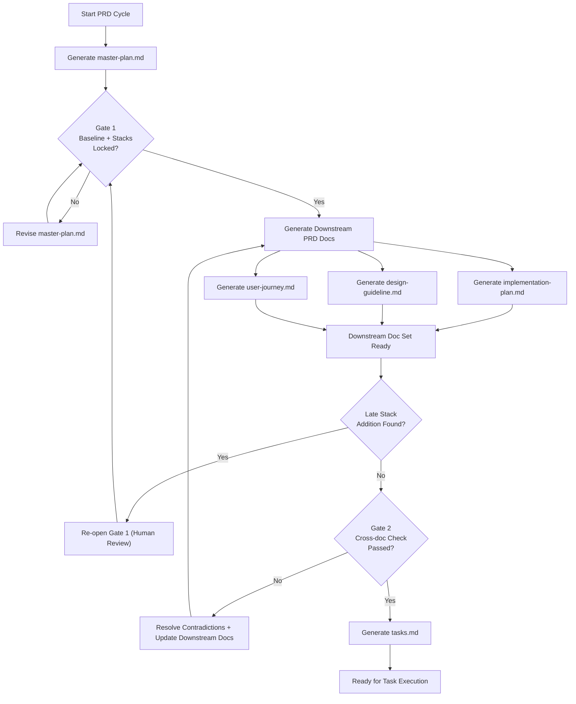

# PRD Rules (v5)

## A. Purpose and PRD File Set
This rulebook defines how PRD files are written, reviewed, and linked through a design-first workflow.

PRD files:
- `master-plan.md`: catalog baseline for scope, stacks, page model, and high-level design intent
- `implementation-plan.md`: technical execution within frozen stacks
- `design-guideline.md`: page-level UI behavior and structure
- `user-journey.md`: user movement and system response across pages
- `tasks.md`: execution-ready tasks with traceability to upstream PRD decisions

## B. Workflow Overview
This section gives one integrated process map.

**PRD workflow overview**


The workflow starts by generating `master-plan.md`, then runs Gate 1 to approve baseline scope and freeze stacks. After Gate 1 approval, the three downstream PRD files are generated in parallel and reconciled at Gate 2. `tasks.md` is generated only after Gate 2 passes, while late stack additions force a Gate 1 reopen before reconciliation can continue.

## C. Master Plan Baseline
`master-plan.md` must be complete before Gate 1. It acts as the catalog baseline for scope, stacks, page model, and high-level design intent.

### Required Core Sections for `master-plan.md`
These sections define the minimum Gate 1 baseline and must appear in `master-plan.md`.

1. Purpose and Users
2. Scope and Non-goals
3. Applicable Stacks Baseline
4. UI Components and Design Patterns
5. Page Inventory and Relationships
6. High-level Design Intent
7. Risks, Decisions, and Stack Additions

### Stack Addition Record Fields
Use this field contract for each stack addition item recorded in the `Risks, Decisions, and Stack Additions` section.

**Stack addition record fields**

| Field | Description |
|---|---|
| `design driver` | Reason the stack addition is being considered |
| `proposed stack addition` | Specific tool, service, or framework being added |
| `alternatives considered` | Reasonable alternatives reviewed before the proposal |
| `expected impact` | Expected effect on `performance`, `security`, `operations`, or `maintenance` |
| `decision status` | One of `approved`, `deferred`, or `rejected` |
| `rationale` | Explanation for the decision and expected tradeoff |

## D. Gate 1 Freeze and Approval
Gate 1 happens after `master-plan.md` is complete and before downstream docs are generated. It freezes baseline scope and stack decisions for the current PRD cycle.

Gate 1 checks:
1. `master-plan.md` is complete and follows the Section C baseline.
2. In-scope stacks are explicit and each proposed stack addition has a recorded decision status.
3. Scope, page model, and high-level design intent are stable enough to author downstream docs.
4. Gate 1 status, approver, and date are recorded in a sidecar gate metadata file before downstream generation continues.

If a new stack is introduced later, reopen Gate 1 before downstream reconciliation or task generation continues.

### Gate Metadata Storage
Gate metadata should be kept outside the narrative PRD body so review state does not interrupt normal reading flow.

Storage rules:
1. Store gate metadata in `gate-status.json` adjacent to the PRD documents for that PRD cycle.
2. `master-plan.md` may mention that gate metadata exists, but it should not embed the full gate marker block in the document body by default.
3. `gate-status.json` is the canonical source for `gate_1` and `gate_2` status, approver, date, and reopen state when applicable.
4. If a PRD cycle migrates from inline gate markers to sidecar metadata, update the JSON file first and then remove the inline block from the markdown document.

## E. Downstream Document Contracts
Use clear section titles in downstream docs so authors and reviewers can scan quickly.

### `implementation-plan.md`
- Architecture Boundaries
- API and Schema Direction
- Integration and Verification

### `design-guideline.md`
- UI by Page Group
- Component Purpose Map
- Wireframe Layout Sketches
- State Handling

### `user-journey.md`
- Cross-page Flows
- Role Handoffs
- Failure and Recovery Paths

## F. Reconciliation (Gate 2)
Gate 2 validates that implementation, design, and journey docs are consistent before task generation.

Reconciliation checks:
1. No scope contradictions against the master plan baseline.
2. No stack drift beyond Gate 1 approvals.
3. No page-model mismatch across implementation, design, and journey docs.
4. Any unresolved tradeoff is escalated to a human decision and documented.

## G. Task Rules
`tasks.md` is produced only after Gate 2 and should remain traceable to upstream PRD decisions.

**Task field contract**

| Field | What It Captures | Notes |
|---|---|---|
| `task_ref` | Task reference id | Use Section J format |
| `source_refs` | Upstream references | Should include relevant MP/IP/DG/UJ refs |
| `problem` | Why this task exists | Keep concise and concrete |
| `goal` | Expected outcome | Actionable target |
| `stacks_used` | Stacks this task uses | Must align with Gate 1 baseline or Gate 1 re-open decision |
| `test_plan` | How to validate | Static/e2e/integration as applicable |
| `smoke_example` | Fast scenario check | Given/When/Then or command+expected |
| `acceptance_criteria` | Done conditions | Measurable and testable |
| `evidence` | Completion proof | Required when status is done |

Tasks should not introduce unapproved scope or unapproved stack changes. If a task requires a new stack, it must reference a Gate 1 re-open decision.

## H. Authoring Style
Document structure:
1. Start with a short paragraph that states what the document is and what it is for.
2. Apply Section I when choosing, placing, or explaining diagrams and structural summaries.
3. Put additional information such as appendices, reference snippets, checklists, templates, or supporting notes in the last several sections of the document.
4. Normative reference rules may appear after the main workflow is fully described, but before supporting materials such as appendices, checklists, templates, or notes.

Preferred formats:
1. Use short paragraphs for context and intent.
2. Use lists for concise requirements.
3. Use tables for field contracts and other structured reference material such as CLI usage.
4. For a simple file list, a short paragraph, list, or table is acceptable.

Style requirements:
1. Keep statements concrete and scannable.
2. Avoid overusing lists where a short paragraph or table communicates better.
3. Avoid content or topic redundancy.
4. Keep one requirement per line by default.
5. Grouped prose is allowed when the bundled items are the same kind of requirement.

## I. Diagram Rules
Use this section for all PRD diagram-selection, placement, and explanation decisions.

Diagram usage:
1. Add a diagram only when it materially improves understanding of scope, structure, boundaries, page relationships, domain logic, state transitions, role handoffs, or task traceability.
2. When a section needs structure but not a visual, use a compact structural summary instead of forcing a diagram.
3. Add a short lead-in sentence above each diagram or structural summary unless the section title already introduces it.
4. Add follow-up text below each diagram or structural summary for deeper explanation.
5. Core sections should usually follow the same order as the diagram or structural summary, covering each main node section by section.

Diagram usage matrix:

| Usage | Diagram types | Documents |
|---|---|---|
| High-level scope, capability, system context, roadmap, or page relationships. Do not use user-journey-style interaction flow here unless the product is inherently linear. | `Flowchart`, `Timeline` | `master-plan.md` |
| Domain structure, schema relationships, service boundaries, and technical interfaces. | `Class Diagram`, `Entity Relationship Diagram`, `Architecture` | `implementation-plan.md` |
| UI state handling, page-region layout, component grouping, screen anatomy, or file structure. | `State Diagram`, `Block Diagram` | `design-guideline.md` |
| Role handoffs, cross-page flows, recovery paths, and experience progression over time. | `Sequence Diagram`, `User Journey`, optional `ZenUML` | `user-journey.md` |
| Workflow status summary for the execution backlog. | `Kanban` | `tasks.md` |

Rarely used diagrams:
1. `C4 Diagram` may be used in `master-plan.md` when high-level system context is important and the renderer supports it.
2. `Requirement Diagram` may be used in `tasks.md` only when task dependency or traceability structure cannot be communicated clearly by task fields, tables, and source references alone.
3. `Gantt` may be used in `tasks.md` only when task scheduling or release timing needs explicit visualization.
4. `Pie Chart`, `Quadrant Chart`, `GitGraph (Git) Diagram`, `Mindmaps`, `Sankey`, `XY Chart`, `Treemap`, `Packet`, `Radar`, and `Venn` are not part of the normal PRD toolkit and should be used only when a document explicitly needs their native data semantics.

Mermaid conventions:
1. Prefer vertical flow (`flowchart TB`) for long or dense labels.
2. Keep gate labels compact and balanced across lines.
3. Use a diagram type for its native semantics, not because its shape resembles the intended output. For example, do not use `Treemap` to imitate UI layout because it encodes hierarchical proportions rather than spatial interface regions.
4. Treat `Kanban` in `tasks.md` as a derived status view, not as the canonical source of task requirements, acceptance criteria, or evidence.
5. Use `block-beta`, a small table, or an ASCII wireframe when the purpose is to illustrate UI region layout or file structure.
6. Do not use quantitative chart types as substitutes for structural or workflow diagrams.

## J. Reference Format
References are required only for statements in the five PRD files listed in Section A that are intended to be cited across PRD files. `PRD-rules.md` does not need reusable reference ids unless a future workflow explicitly requires them.

Reference format:
1. Use `<DOC>-<SectionLetter><Number>` for each reference id, for example `MP-B3`.
2. Numbered list items and titled non-list items share one numbering sequence within the same section.
3. Assign reference ids in reading order within the section so each reference target is unique.
4. Use GitHub footnotes as the default human-readable reference presentation so reusable ids do not interrupt normal reading flow.
5. A titled non-list item should use a title-attached footnote id and cite the footnote content directly.
6. A numbered list item should place its reference id in a trailing footnote marker rather than inline at the start of the sentence.
7. A whole table uses the table title footnote id, for example `MP-C3`.
8. A table cell may use its own footnote id when that specific cell needs to be referenced directly.

Example title footnote pattern:

```md
**Workflow overview**[^MP-B4]
```

Example numbered list item pattern:

```md
1. In scope are authenticated workspaces, team membership, and project creation.[^MP-C1]
```

Example titled table footnote pattern:

```md
**Stack addition record fields**[^MP-C3]

| Field | Description |
|---|---|
| `decision status` | One of `approved`, `deferred`, or `rejected` |
```

Example table cell footnote pattern:

```md
| Field | Description |
|---|---|
| `decision status`[^MP-C3.a] | One of `approved`, `deferred`, or `rejected` |
```

## K. Transition Policy
This policy applies to new PRD cycles and major rewrites. Existing PRDs can migrate incrementally. During migration, declare current section mapping and gate status before continuing work.

## L. Quality Checklist

- [ ] Section A defines the PRD file set and makes each file purpose explicit.
- [ ] Section B reflects PRD generation order, gate timing, and rework paths.
- [ ] Section C defines a complete Gate 1 baseline for `master-plan.md`.
- [ ] Section C stack addition records use the required field contract when applicable.
- [ ] Section D records Gate 1 status, approver, date, and any required re-open in the canonical gate metadata file.
- [ ] Section E downstream docs use clear section titles and stay aligned with the master-plan baseline.
- [ ] Section F reconciliation is complete before `tasks.md` generation continues.
- [ ] Section F leaves no unresolved contradictions or undocumented tradeoffs.
- [ ] Section G tasks include required traceability, validation, and evidence fields.
- [ ] Section G smoke checks align with task behavior and acceptance criteria when applicable.
- [ ] Section H authoring style is followed, including structure, preferred formats, and section ordering.
- [ ] Section I diagram rules are followed, including diagram-selection criteria, file-specific placement, structural summary fallback, and Mermaid conventions.
- [ ] Section J reference formatting is used wherever reusable PRD citations are required, with footnote-based presentation by default.
- [ ] Section K migration notes declare current section mapping and gate status when applicable.

## M. Sub-Agent Operating Model [Optional]
1. Architect lane drafts constraints and stack implications.
2. Design lane drafts page-level UI behavior and layouts.
3. Journey lane drafts transitions, failures, and recovery flow.
4. Reconciliation lane checks cross-doc consistency before tasks.
5. One author can perform all lanes if output quality is equivalent.

## N. Minimal Templates [Optional]
Gate metadata sidecar:

```json
{
  "gate_1": {
    "status": "pending | approved | reopened",
    "approver": "<name/role>",
    "date": "<YYYY-MM-DD>"
  },
  "gate_2": {
    "status": "pending | approved",
    "approver": "<name/role>",
    "date": "<YYYY-MM-DD>"
  }
}
```

Task snippet (minimal complete):

```md
task_ref: TS-F3
source_refs: MP-C5, IP-D1, DG-D2, UJ-E3
problem: ...
goal: ...
stacks_used: Next.js App Router, Drizzle ORM, Clerk
test_plan: verify:static, verify:e2e
smoke_example: Given ..., when ..., then ...
acceptance_criteria: ...
evidence: <required when status is done>
```
