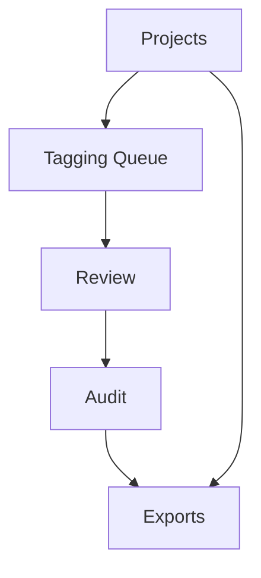

# Image Tagger Design Guideline

**Quick Read**
- objective: Define interaction rules that maximize annotation speed while preserving decision quality.
- target user: Annotator, reviewer, project owner, auditor.
- in-scope: Navigation model, interaction patterns, accessibility and microcopy rules.
- out-of-scope: Brand marketing pages, public-facing onboarding site, design-token package publishing.
- current status: Draft v0 aligned with [master-plan](./master-plan.md) and [user-journey](./user-journey.md).
- related docs: [master-plan](./master-plan.md), [user-journey](./user-journey.md), [implementation-plan](./implementation-plan.md), [tasks](./tasks.md)

## Design Principles and UX Tone
`DG-001` favors speed with confidence: every key annotation action must complete in one interaction and show immediate state feedback. `DG-002` favors clarity over decoration: queue state, round state, and blind status remain visible at all times. `DG-003` favors reversible operations for non-final actions and explicit confirmations for irreversible actions (`freeze`, `override`). `DG-004` favors cognitive consistency: controls and shortcuts remain stable across project views. `DG-005` sets UX tone as precise, operational, and low-friction, matching professional labeling workflows instead of social-media-style patterns. `DG-005a` requires every new screen to identify its primary action and remove secondary controls that do not support throughput or quality outcomes.

## Information Architecture and Navigation
`DG-006` primary nav contains `Projects`, `Tagging Queue`, `Review`, `Audit`, and `Exports`. `DG-007` project context selector is persistent in header and required before queue actions. `DG-008` queue pages use split layout: image canvas center, tag actions right rail, metadata and history lower panel. `DG-009` review pages prioritize disagreement evidence with side-by-side round outputs and confidence annotations. `DG-010` audit pages provide filter-first tables with drill-down details, not card-heavy browsing.

IA summary: Navigation follows the work lifecycle from ingestion through export. Every surface keeps project context pinned, so users never act on the wrong dataset.

## Component and Interaction Rules
`DG-011` tagging panel must support hotkeys (`1-9`, `A-Z`) with conflict-free mapping shown inline. `DG-012` next-image transition target is <= 250 ms at p95 after submit, with a warm-cache aspirational goal of <= 120 ms. `DG-013` blind rounds must hide prior labels by default, with reviewer-only reveal controls behind explicit permission. `DG-014` queue ownership chips show annotator/shift assignment and SLA badge. `DG-015` reviewer resolution modal must capture final decision, rationale code, and confidence tier. `DG-016` export drawer must show schema version, selected scope, and pre-export validation status before download is enabled.

## Accessibility Rules
`DG-017` all annotation, review, and export actions must be keyboard reachable with visible focus states. `DG-018` color alone cannot encode label state, disagreement, or urgency; icon and text cues are required. `DG-019` minimum contrast is WCAG AA for all interactive controls and tag badges. `DG-020` image zoom, pan, and alternate text metadata must be available for low-vision workflows and fine-grained inspection. `DG-021` error messaging must be read by screen readers through ARIA live regions with deterministic field focus recovery. Accessibility checks are part of release readiness, and regressions are treated as blocking issues for production rollout.

## Content and Microcopy Rules
`DG-022` microcopy uses operational verbs (`Assign`, `Submit`, `Escalate`, `Freeze`, `Export`) and avoids ambiguous terms (`Done`, `Okay`). `DG-023` uncertainty prompts require specific reason codes (`blur`, `occlusion`, `ambiguous class`) instead of free-text defaults. `DG-024` destructive or finalizing actions include numeric impact summaries, for example unresolved count and affected record totals. `DG-025` audit explanations must separate fact from decision, showing original labels, reviewer changes, and timestamps distinctly. `DG-026` export errors must include corrective hint text tied to schema field names so users can resolve issues without developer support.
