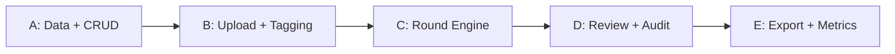

# Image Tagger Implementation Plan

**Quick Read**
- objective: Define technical slices and delivery order for the reusable image tagger in `next-app`.
- target user: Engineers implementing product, data, and QA workflows.
- in-scope: Architecture boundaries, sequence, verification, rollback, and NFR constraints.
- out-of-scope: Multi-region deployment, training pipeline orchestration, auto-label model serving.
- current status: Draft v0 implementation blueprint.
- related docs: [master-plan](./master-plan.md), [user-journey](./user-journey.md), [design-guideline](./design-guideline.md), [tasks](./tasks.md)

## Architecture Slices and Boundaries
`IP-001` Product slice: Next.js App Router pages for projects, tagging queue, review, audit, and export (`DG-006` to `DG-016`). `IP-002` Data slice: Drizzle schema for projects, images, tag schemas, assignments, decisions, and audit events. `IP-003` Workflow slice: assignment engine for rounds, blind rotation, shift ownership, and escalation routing (`MP-003`, `UJ-014`). `IP-004` Integration slice: upload ingest path, auth controls, and monitoring hooks in existing scaffold. `IP-005` Reporting slice: metrics events and JSON export API with versioned schema contract (`MP-015`). Boundaries require each slice to expose stable interfaces so rollout can proceed incrementally.

## Delivery Sequence and Dependencies
`IP-006` Sequence A builds schema and minimal CRUD endpoints for project/image/tag entities. `IP-007` Sequence B builds upload and queue UI with keyboard annotation path. `IP-008` Sequence C adds round orchestration, blind rotation, and shift handoff behavior. `IP-009` Sequence D adds reviewer/auditor experiences with disagreement and escalation logic. `IP-010` Sequence E adds export validation and downloadable JSON endpoints plus KPI dashboards. Dependencies are strictly upstream-to-downstream: no review, audit, or export work starts until assignment and provenance data contracts are stable.

Sequence summary: Each step unlocks the next and keeps test surfaces narrow. This ordering also delivers usable product value early while preserving final traceability requirements.

## Verification Strategy
`IP-011` static gates use `bun run verify:static` and must pass before merge. `IP-012` preflight gate uses `bun run verify:preflight` to enforce required secrets and record blocked state. `IP-013` integration gate uses `bun run verify:integration` plus contract checks for workflow state transitions and export schema validity. `IP-014` e2e gate uses `bun run verify:e2e` with scenarios for project setup, round completion, disagreement review, and export. `IP-015` release gate uses `bun run verify:all` in staging with sample projects and measured KPI snapshots tied to `MP-011` through `MP-015`. Verification evidence is archived per build with links to logs and explicit failing case IDs for fast triage.

## Migration/Rollback Plan
`IP-016` introduces new tables with additive migrations first; no destructive migration is allowed until two release cycles pass. `IP-017` feature flags gate round engine, audit queue, and export APIs independently so regressions can be isolated quickly. `IP-018` rollback rule: if disagreement queue latency or export validation error rate breaches threshold for 30 minutes, disable newest flagged slice and preserve data writes. `IP-019` migration safeguards include idempotent backfills and explicit null-handling for legacy images. `IP-020` recovery checklist requires post-rollback integrity checks for assignment states and audit event continuity.

## Performance/Security Constraints
`IP-021` upload ingestion must support at least 10,000 images per project with resumable state tracking. `IP-022` tagging queue page must keep p95 interaction latency under 250 ms for submit-next action at moderate concurrency. `IP-023` all decision mutations require authenticated user context and append-only audit event records (`UJ-018`). `IP-024` export endpoints require project-scoped authorization and signed download URLs with short TTL. `IP-025` personally identifiable data is minimized in event payloads and logs, and secret-dependent verification is enforced by preflight before integration/e2e execution.
