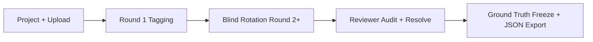
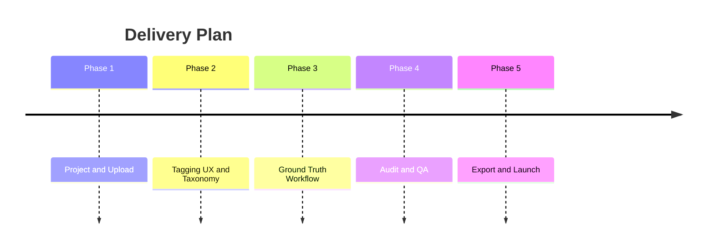

# Image Tagger Master Plan

**Quick Read**
- objective: Build a reusable, project-oriented image tagging system with reliable ground truth and auditability.
- target user: Dataset managers, human annotators, QA reviewers, and ML engineers.
- in-scope: Project/image ingestion, custom tagging UI, multi-round blind assignment, audit workflows, JSON export.
- out-of-scope: Model training pipelines, auto-labeling quality claims, advanced ontology versioning marketplace.
- current status: Draft v0 for implementation planning.
- related docs: [user-journey](./user-journey.md), [design-guideline](./design-guideline.md), [implementation-plan](./implementation-plan.md), [tasks](./tasks.md)

## Vision and Problem
Teams repeatedly rebuild lightweight labeling tools per project, then lose annotation speed and quality because workflow rules are implicit and hard to audit. This product standardizes one reusable tagging system across projects with explicit quality controls. `MP-001` defines a workspace with isolated projects and image sets. `MP-002` defines fast, human-efficient custom tagging with keyboard-first actions. `MP-003` defines ground-truth preservation through multi-round assignment and blind rotation so decisions are less biased by prior labels. `MP-004` defines auditable outputs and downloadable machine-readable results for downstream systems.

Flow summary: Work starts with project-scoped ingestion, then runs in structured rounds. Blind rotation reduces anchoring and reviewer bias before finalization. The endpoint is a frozen, auditable ground-truth set with export-ready JSON.

## Scope and Non-goals
Scope is limited to features required for accurate and repeatable human labeling across many projects. `MP-005` requires project creation with metadata and role assignments. `MP-006` requires batch image upload with progress and retry visibility. `MP-007` requires per-project custom tag sets, including mutually exclusive and multi-select modes. `MP-008` requires assignment orchestration across rounds, shifts, and blind rotation rules. `MP-009` requires audit surfaces for disagreement analysis and record-level review. `MP-010` sets non-goals: no model training orchestration, no external workforce marketplace, and no automated label acceptance without human review.

## Success Metrics (KPIs)
Success is measured by speed, quality, and traceability rather than raw throughput alone. `MP-011`: median annotation time per image is <= 8 seconds for single-label tasks after onboarding week two. `MP-012`: at least 95% of completed records include full provenance (annotator, round, timestamp, decision state). `MP-013`: disagreement rate between first two blind rounds drops below 12% for stable tag schemas. `MP-014`: audit queue resolution SLA is <= 48 hours for P1 datasets. `MP-015`: JSON export pass rate is 100% against schema validation and downstream import smoke checks.

## Milestones and Roadmap
Delivery is phased to reduce risk while keeping end-to-end value visible early. `MP-016` (Phase 1) ships project creation, upload, and baseline tagging UI. `MP-017` (Phase 2) adds custom taxonomy management and keyboard-optimized flows. `MP-018` (Phase 3) adds multi-round assignments, blind rotation, and shift handoff controls. `MP-019` (Phase 4) ships audit queue, discrepancy triage, and reviewer actions. `MP-020` (Phase 5) ships export API/UI, pilot hardening, and release criteria checks.

Roadmap summary: Sequence favors early usable flows, then quality-preserving controls, then audit/export readiness. Each phase has a demoable output and measurable gate before moving forward.

## Risks and Key Decisions
`MP-021` risk: ambiguous tag definitions can inflate disagreement; decision is to require schema notes and examples per tag. `MP-022` risk: blind rotation can increase operational complexity; decision is to implement deterministic assignment rules and explainability logs. `MP-023` risk: high-volume uploads may stall UI responsiveness; decision is async processing with durable job states. `MP-024` risk: audit backlog can grow during peak labeling windows; decision is SLA-based prioritization and escalation lanes. `MP-025` decision: JSON export contract is versioned and backward compatible per minor release to protect downstream consumers.
