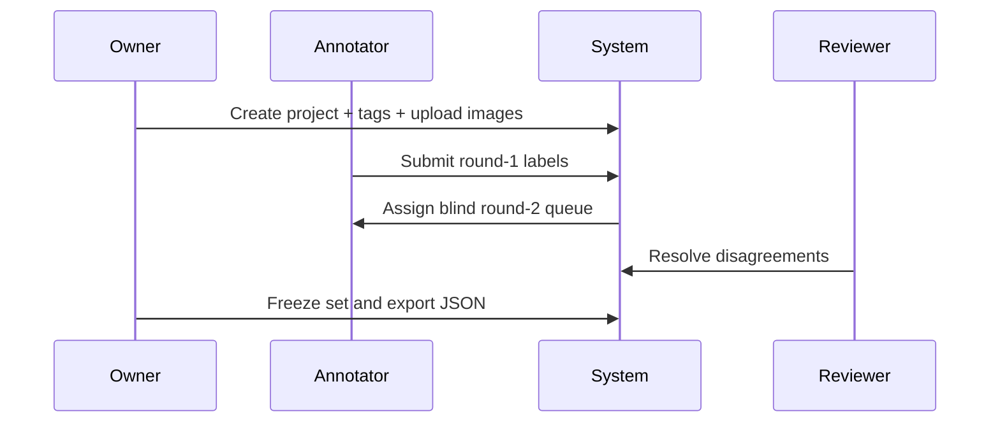

# Image Tagger User Journey

**Quick Read**
- objective: Define user flows that produce fast annotations and defensible ground truth.
- target user: Project owner, annotator, reviewer, auditor.
- in-scope: Happy paths, recovery behavior, friction controls, instrumentation points.
- out-of-scope: Workforce recruiting, training curriculum management, model-in-the-loop corrections.
- current status: Draft v0 aligned with [master-plan](./master-plan.md).
- related docs: [master-plan](./master-plan.md), [design-guideline](./design-guideline.md), [implementation-plan](./implementation-plan.md), [tasks](./tasks.md)

## Personas or Jobs-to-be-Done
`UJ-001` Project Owner needs to spin up projects quickly, define tags clearly, and monitor quality without reading every image. `UJ-002` Annotator needs uninterrupted, keyboard-first tagging sessions with low cognitive overhead and clear queue state. `UJ-003` Reviewer needs efficient disagreement triage and deterministic conflict resolution history. `UJ-004` Auditor needs verifiable provenance and export confidence before sharing results externally. `UJ-005` ML Engineer needs schema-stable JSON outputs with explicit decision states. These personas map to `MP-001`, `MP-002`, `MP-003`, and `MP-004`, and they define what must be optimized: throughput with preserved trust.

## Primary Journeys (Happy Paths)
`UJ-006` Owner creates a project, uploads image batches, and defines tag schema with examples. `UJ-007` Annotator claims a queue and tags each image using shortcut keys, confidence flags, and skip reasons when needed. `UJ-008` System reassigns images into round two using blind rotation so no prior label is shown. `UJ-009` Reviewer opens disagreement queue, inspects evidence, and finalizes consensus state. `UJ-010` Auditor validates summary metrics and downloads JSON by project and round scope.

Flow summary: The journey is progressive and role-aware. The system inserts blind reassignment before review to protect quality. Export is available only after audit and freeze states pass.

## Failure and Recovery Paths
`UJ-011` Upload failure path: when network or file validation fails, the UI keeps successful items, marks failed files, and offers retry for failed subset only. `UJ-012` Ambiguous image path: annotator can mark uncertain with required reason code, routing record to reviewer queue instead of forcing low-confidence tags. `UJ-013` Shift interruption path: in-progress image state autosaves and returns to queue on reassignment timeout. `UJ-014` Audit conflict path: if reviewer confidence remains low, record escalates to a third independent round before freeze. `UJ-015` Export failure path: schema validation errors block download and provide field-level corrective guidance.

## Trust/Friction Moments
The highest trust risks happen when users suspect hidden bias or irreversible mistakes. `UJ-016` requires visible round state and blind-status indicators so annotators know what evidence is intentionally hidden. `UJ-017` requires explicit "freeze" confirmation with counts of unresolved records and blocked exports. `UJ-018` requires immutable activity logs for label edits, reviewer overrides, and assignment rotations. `UJ-019` limits friction by keeping primary tagging actions to one hand on keyboard plus minimal pointer movement. `UJ-020` requires queue transparency (remaining count, SLA urgency, and ownership) to avoid duplicated effort across shifts.

## Journey Metrics and Instrumentation Points
`UJ-021` captures per-image handling time split by role and round. `UJ-022` captures disagreement, override, and escalation rates by tag class. `UJ-023` captures upload retry rates and median recovery time for failed files. `UJ-024` captures autosave restore success for interrupted sessions. `UJ-025` captures export validation failure types and correction latency. Events are tied to `MP-011` through `MP-015` so dashboard reporting directly answers KPI status instead of producing disconnected analytics. Instrumentation is event-versioned and stored with project context, shift window, and round number for reliable cohort analysis.
